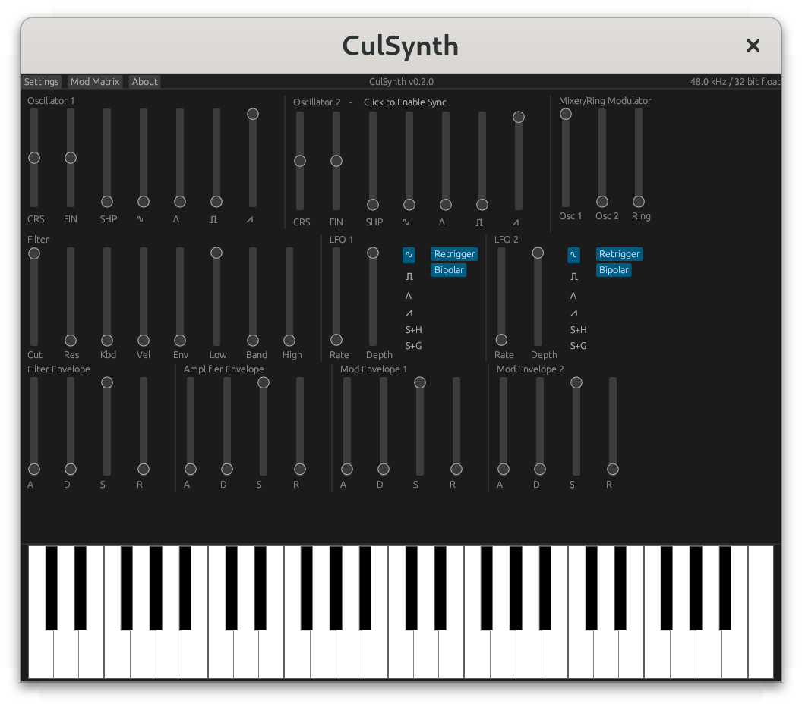

# CulSynth

CulSynth is currently a DSP library and [nih-plug](https://github.com/robbert-vdh/nih-plug)
based virtual instrument written in Rust.



## Goals

The eventual goal is to create a synthesizer that can be deployed both as a virtual
instrument and on embedded hardware, to allow users to prototype sound designs
with the expressiveness of physical knobs and hardware then seamlessly move those
patches into a virtual instrument inside a DAW for further use without requiring
sampling or reprogramming.

## Usage

The plugin can either be used as a standalone binary by building and then running
the `culsynth-standalone` binary, or can be used as a VST3/CLAP plugin.  Currently
only VST3 is being tested.  Generating the plugin is simple:  just build it for
your platform then copy the generated `.so` or `.dll` file to your VST plugins
folder:

On Linux:

```bash
$ cargo build --release
$ cp target/release/libculsynth_plugin.so ~/.vst3/culsynth.vst3
```

On Windows:

```bat
> cargo build --release
> copy target\release\libculsynth_plugin.dll C:\Program Files\Common Files\VST3\culsynth.vst3
```

## Licensing

This project is licensed under the MIT License.  However, due to the licensing
of the bindings any plugins built in VST3 format are licensed under the terms of
the GPLv3.  It incorporates several dependencies under the MIT, Apache v2, BSD,
ISC, Boost, and ZLib licenses.

This project incorporates fonts from the Noto Project and Google under the terms
of the SIL Open Font License v1.1 (see `resources/fonts/OFL.txt`).

## Dependencies

For Rust dependencies, see `Cargo.toml`.

On Linux, the following packages (Debian names provided, but should be similar on other
distros) need to be installed in order to successfully compile:

- `libx11-xcb-dev`
- `libxcb-icccm4-dev`
- `libxcb-dri2-0-dev`
- `libasound2-dev`
- `libglu1-mesa-dev`
- `libjack-jackd2-dev`

## Future Work

- [ ] Documentation - currently exists, but very light on specifics/examples
- [ ] Better UI for modulation - currently must manually edit the matrix
- [ ] Fixed point profiling/optimization
- [ ] More MIDI CC implementations, patch memory, etc.
- [ ] Port to RPi Pico
- [ ] WebASM backend (explore feasibility)
